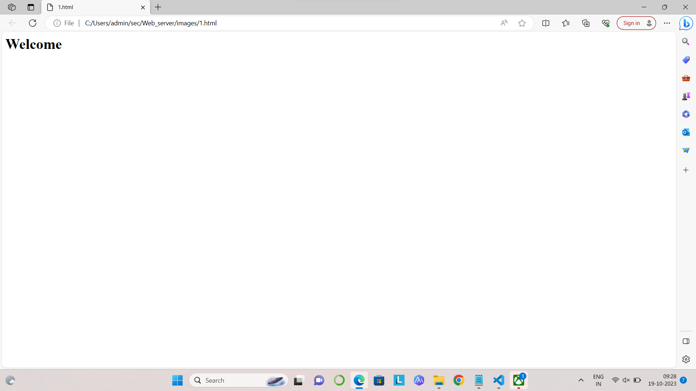

# Developing a Simple Webserver

Name:dakshata
ref no:23013965
dept:aiml

# AIM:

Develop a webserver to display about top five web application development frameworks.

# DESIGN STEPS:

## Step 1:

HTML content creation is done

## Step 2:

Design of webserver workflow

## Step 3:

Implementation using Python code

## Step 4:

Serving the HTML pages.

## Step 5:

Testing the webserver
# PROGRAM:
```
from http.server import HTTPServer, BaseHTTPRequestHandler

content="""

<html>
<head>
</head>
<body>
<h1>Welcome</h1>
</body>
</html>
"""

class MyHandler(BaseHTTPRequestHandler):
    def do_GET(self):
        self.send_response(200)
        self.send_header('Content-type', 'text/html')
        self.end_headers()
        self.wfile.write(content.encode())


server_address=('',80)
httpd=HTTPServer(server_address,HelloHandler)
httpd.serve_forever()

```
# OUTPUT:



# RESULT:

The program is executed succesfully
